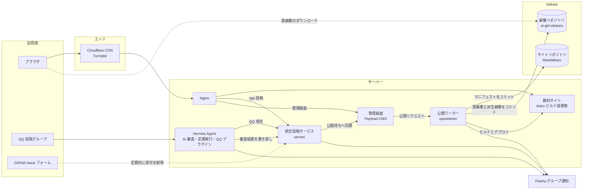
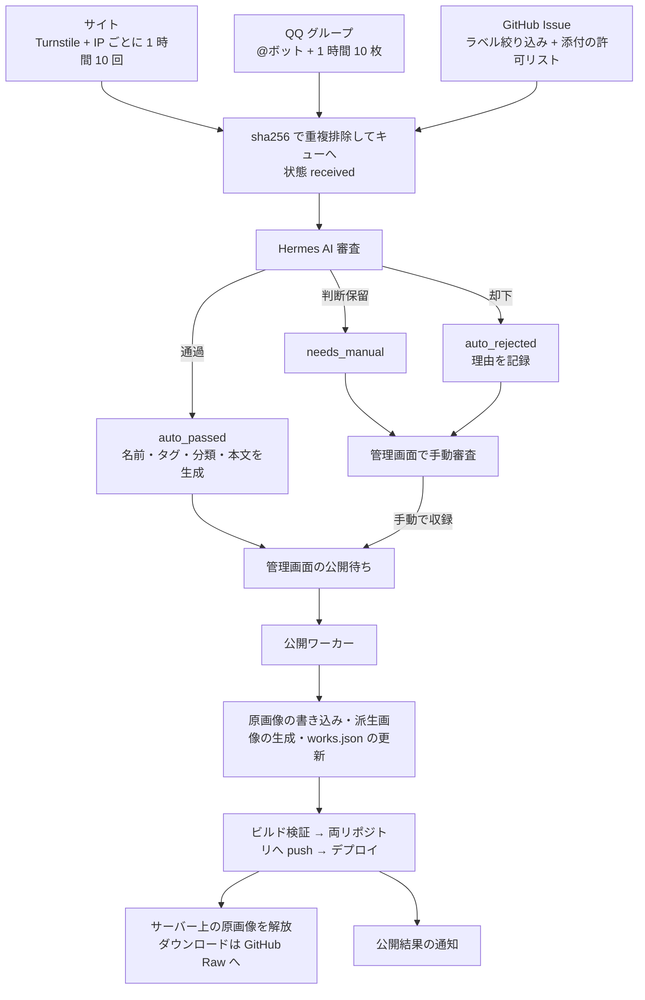
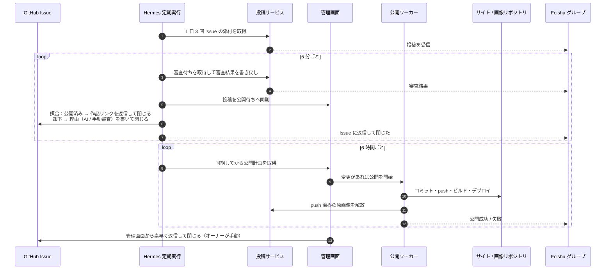

<div align="center">
  
  <h1>Blue Big Fish</h1>
  <p><strong>AI 娘の二次創作スタンプを集めたオープンアーカイブ</strong></p>
  <p>
    <a href="https://xn--pssy23gqgbz2d718b.com/"></a>
    <a href="frontend/"></a>
    <a href="package.json"></a>
    <a href="LICENSE"></a>
  </p>
  <p>
    <a href="README.md">简体中文</a> ·
    <a href="README.en.md">English</a> ·
    <strong>日本語</strong>
  </p>
</div>

---

Blue Big Fish は、AI 娘の二次創作スタンプを集めたオープンアーカイブです。ミーム、イラスト、設定資料、漫画をキャラクターごとに整理しています。名前、タグ、キャラクターの別名で検索できます。各作品には個別ページがあり、出典とライセンスを確認して原画をダウンロードできます。

UI は中国語、英語、日本語に対応しています。

## プロジェクト概要

| 項目 | 内容 |
| --- | --- |
| フロントエンド | Astro で構築した静的サイト |
| UI 言語 | 中国語、英語、日本語 |
| 作品種別 | ミーム、イラスト、設定資料、漫画 |
| 画像 | 独立した公開画像アーカイブに保存 |
| 投稿方法 | サイト内フォーム、QQ グループ Bot、GitHub Issue フォーム |

## 主なリンク

| 用途 | リンク |
| --- | --- |
| オンラインで閲覧 | <https://xn--pssy23gqgbz2d718b.com/> |
| サイト内投稿 | <https://xn--pssy23gqgbz2d718b.com/submit.html> |
| QQ グループ投稿 | 投稿グループで Bot を @ し、「投稿 标题 角色」と画像を同じメッセージで送信 |
| GitHub Issue 投稿 | <https://github.com/lmy414/ai-girl-stickers/issues/new?template=sticker-submission.yml> |
| クレジット修正・削除依頼 | <https://github.com/lmy414/ai-girl-stickers/issues/new?template=takedown-request.yml> |
| 画像アーカイブ | <https://github.com/lmy414/ai-girl-stickers> |

## リポジトリの役割

| リポジトリ | 役割 |
| --- | --- |
| `bluedafeiyu`（このリポジトリ） | Astro フロントエンド、構造化データ、ビルドスクリプト、投稿サービス、公開ツール |
| `ai-girl-stickers` | 投稿原画、派生画像、サイト画像素材、投稿・削除依頼フォーム |

このリポジトリでページを生成し、画像アーカイブで画像を保存します。ここでは画像ファイルを管理しません。ビルド時に画像アーカイブから同期します。

## システム構成

以下の 3 つの図はコンポーネントと処理の流れだけを示し、本番ホスト、ポート、秘密情報は含みません。

### サイト構成



### データ処理の流れ



### 同期の流れ


## ディレクトリ構成

| パス | 内容 |
| --- | --- |
| `frontend/` | Astro のソース。ページは `src/pages/`、レイアウトとコンポーネントは `src/layouts/` と `src/components/`、公開アセットは `public/` |
| `data/` | キャラクター、カテゴリ、作品、サイト運営者のおすすめ、特集、編集用オーバーレイの正本 JSON |
| `tools/` | ビルド、コンテンツ同期、データ一時展開、スナップショット生成、画像派生、静的圧縮スクリプト |
| `server/` | Web、QQ グループ、GitHub Issue を統合する投稿サービス。本番稼働中 |
| `tools/intake/` | 管理者向けの取込ツール。重複確認、一時保管、GitHub Issue 添付の取込を担当 |
| `ops/` | デプロイ、ロールバック、審査・公開自動化、サーバー設定例 |
| `docs/` | 通信高速化、CDN、投稿自動化、Hermes 審査などの保守資料 |
| `archive/` | リポジトリ分割前の履歴資料 |
| `dist/`、`.build/`、`frontend/out/` | ビルド時またはローカル実行時の生成物。フロントエンドのソースではありません |

詳しい使い方は [`server/README.md`](server/README.md) と [`tools/intake/README.md`](tools/intake/README.md) を参照してください。一般投稿はサイト内フォーム、QQ グループ Bot、画像アーカイブの GitHub Issue フォームから受け付けます。

## ブランド素材

README のヘッダーでは、画像アーカイブの `dist/avatar.png` を使用しています。主な素材は次のとおりです。

| ファイル | サイズ | 用途 |
| --- | --- | --- |
| [`dist/avatar.png`](https://github.com/lmy414/ai-girl-stickers/blob/main/dist/avatar.png) | 96 × 96 | サイトのアバターと README ロゴ |
| [`dist/favicon.ico`](https://github.com/lmy414/ai-girl-stickers/blob/main/dist/favicon.ico) | 256 × 256 | ブラウザータブのアイコン |
| [`dist/favicon.png`](https://github.com/lmy414/ai-girl-stickers/blob/main/dist/favicon.png) | 512 × 512 | 高解像度のサイトアイコン |
| [`dist/qq-group.png`](https://github.com/lmy414/ai-girl-stickers/blob/main/dist/qq-group.png) | 518 × 518 | QQ グループの QR コード |

## ローカルプレビュー

サイトの閲覧だけならローカル環境は不要です。フロントエンドを変更する場合やビルドを確認する場合は、Node.js 22.12 以降と画像アーカイブのクローンを用意します。

```powershell
cd frontend
npm ci
cd ..
node tools/build_site.mjs --content-dir <画像アーカイブのパス> --out .build/site
python -m http.server 5173 -d .build/site
```

ビルド結果は `.build/site/` に出力されます。フロントエンドの詳細は [`frontend/README.md`](frontend/README.md)、デプロイとサーバー設定は [`docs/`](docs/) を参照してください。

## 投稿と著作権

これは非公式の同人アーカイブです。投稿はサイト内フォーム、QQ グループ Bot、画像アーカイブの GitHub Issue フォームから受け付けます。クレジット修正と削除依頼は引き続き GitHub Issue フォームを使用します。詳しいルールは [`CONTRIBUTING.md`](https://github.com/lmy414/ai-girl-stickers/blob/main/CONTRIBUTING.md) を参照してください。

画像の著作権は常に原作者に帰属します。このリポジトリで公開されたことやサイトに掲載されたことによって、画像に MIT ライセンスが自動的に付与されることはありません。再利用する前に、各作品の個別ページに記載された出典とライセンスを確認してください。このリポジトリのコードは MIT ライセンスで公開しています。詳細は [`LICENSE`](LICENSE) を参照してください。
